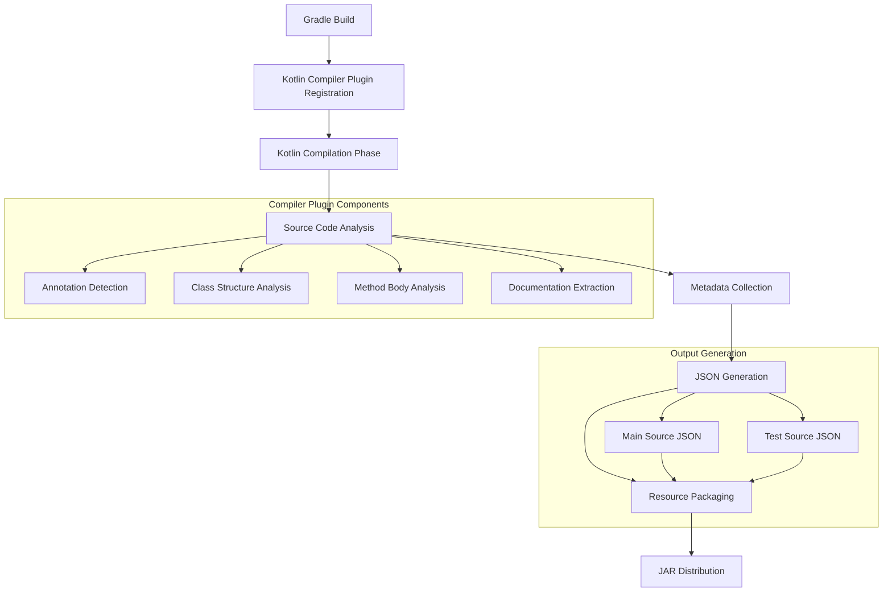
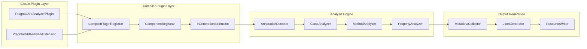

# Design Document

## Overview

The pragma-ddd-analyzer will be enhanced to use a Kotlin Compiler Plugin approach instead of the current bytecode analysis method. This design transforms the analyzer from a post-compilation bytecode analyzer into a compile-time source code analyzer that integrates directly with the Kotlin compilation process.

The system will consist of three main components:
1. **Kotlin Compiler Plugin** - Analyzes source code during compilation
2. **Gradle Plugin** - Integrates the compiler plugin and manages configuration
3. **JSON Generator** - Produces metadata files that are packaged with JAR distributions

## Architecture

### High-Level Architecture



### Component Architecture



## Components and Interfaces

### 1. Gradle Plugin Components

#### PragmaDddAnalyzerPlugin
```kotlin
interface PragmaDddAnalyzerPlugin : Plugin<Project> {
    fun apply(project: Project)
    fun registerCompilerPlugin(project: Project)
    fun configureOutputDirectories(project: Project)
}
```

#### PragmaDddAnalyzerExtension (Enhanced)
```kotlin
abstract class PragmaDddAnalyzerExtension {
    abstract val outputDirectory: Property<String>
    abstract val includeTestSources: Property<Boolean>
    abstract val jsonFileNaming: Property<String>
    abstract val enableMethodAnalysis: Property<Boolean>
    abstract val enablePropertyAnalysis: Property<Boolean>
    abstract val enableDocumentationExtraction: Property<Boolean>
}
```

### 2. Kotlin Compiler Plugin Components

#### CompilerPluginRegistrar
```kotlin
interface CompilerPluginRegistrar {
    fun registerExtensions(configuration: CompilerConfiguration)
    fun createIrExtension(): IrGenerationExtension
}
```

#### DddAnalysisExtension
```kotlin
interface DddAnalysisExtension : IrGenerationExtension {
    fun generate(moduleFragment: IrModuleFragment, pluginContext: IrPluginContext)
    fun analyzeClasses(classes: List<IrClass>)
}
```

### 3. Analysis Engine Components

#### AnnotationDetector
```kotlin
interface AnnotationDetector {
    fun hasAggregateRootAnnotation(irClass: IrClass): Boolean
    fun hasDomainEntityAnnotation(irClass: IrClass): Boolean
    fun hasValueObjAnnotation(irClass: IrClass): Boolean
    fun extractAnnotationMetadata(irAnnotation: IrConstructorCall): AnnotationMetadata
}
```

#### ClassAnalyzer
```kotlin
interface ClassAnalyzer {
    fun analyzeClass(irClass: IrClass): ClassMetadata
    fun extractProperties(irClass: IrClass): List<PropertyMetadata>
    fun extractMethods(irClass: IrClass): List<MethodMetadata>
    fun extractDocumentation(irClass: IrClass): DocumentationMetadata?
}
```

#### MethodAnalyzer
```kotlin
interface MethodAnalyzer {
    fun analyzeMethod(irFunction: IrFunction): MethodMetadata
    fun extractMethodCalls(irFunction: IrFunction): List<MethodCallMetadata>
    fun extractPropertyAccess(irFunction: IrFunction): List<PropertyAccessMetadata>
    fun extractDocumentation(irFunction: IrFunction): DocumentationMetadata?
}
```

### 4. Output Generation Components

#### MetadataCollector
```kotlin
interface MetadataCollector {
    fun collectClassMetadata(irClass: IrClass): ClassMetadata
    fun addToMainSources(metadata: ClassMetadata)
    fun addToTestSources(metadata: ClassMetadata)
    fun getMainSourcesMetadata(): List<ClassMetadata>
    fun getTestSourcesMetadata(): List<ClassMetadata>
}
```

#### JsonGenerator
```kotlin
interface JsonGenerator {
    fun generateMainSourcesJson(metadata: List<ClassMetadata>): String
    fun generateTestSourcesJson(metadata: List<ClassMetadata>): String
    fun writeToFile(json: String, outputPath: String)
}
```

## Data Models

### Core Metadata Models

```kotlin
data class ClassMetadata(
    val className: String,
    val packageName: String,
    val annotationType: DddAnnotationType,
    val properties: List<PropertyMetadata>,
    val methods: List<MethodMetadata>,
    val documentation: DocumentationMetadata?,
    val annotations: List<AnnotationMetadata>
)

data class PropertyMetadata(
    val name: String,
    val type: String,
    val isPrivate: Boolean,
    val isMutable: Boolean,
    val documentation: DocumentationMetadata?,
    val annotations: List<AnnotationMetadata>
)

data class MethodMetadata(
    val name: String,
    val parameters: List<ParameterMetadata>,
    val returnType: String,
    val isPrivate: Boolean,
    val methodCalls: List<MethodCallMetadata>,
    val propertyAccesses: List<PropertyAccessMetadata>,
    val documentation: DocumentationMetadata?,
    val annotations: List<AnnotationMetadata>
)

data class MethodCallMetadata(
    val targetMethod: String,
    val receiverType: String?,
    val parameters: List<String>
)

data class PropertyAccessMetadata(
    val propertyName: String,
    val accessType: PropertyAccessType,
    val ownerClass: String?
)

data class DocumentationMetadata(
    val summary: String?,
    val description: String?,
    val parameters: Map<String, String>,
    val returnDescription: String?
)

enum class DddAnnotationType {
    AGGREGATE_ROOT,
    DOMAIN_ENTITY,
    VALUE_OBJ
}

enum class PropertyAccessType {
    READ,
    WRITE
}
```

### JSON Output Schema

```json
{
  "generatedAt": "2024-01-15T10:30:00Z",
  "sourceType": "main|test",
  "classes": [
    {
      "className": "com.example.User",
      "packageName": "com.example",
      "annotationType": "AGGREGATE_ROOT",
      "documentation": {
        "summary": "User aggregate root example",
        "description": "Detailed description...",
        "parameters": {},
        "returnDescription": null
      },
      "annotations": [
        {
          "name": "AggregateRoot",
          "parameters": {}
        }
      ],
      "properties": [
        {
          "name": "id",
          "type": "String",
          "isPrivate": true,
          "isMutable": false,
          "documentation": null,
          "annotations": []
        }
      ],
      "methods": [
        {
          "name": "updateProfile",
          "parameters": [
            {
              "name": "newName",
              "type": "String"
            }
          ],
          "returnType": "Unit",
          "isPrivate": false,
          "documentation": {
            "summary": "Updates user profile information",
            "description": "Validates and updates name and email",
            "parameters": {
              "newName": "The new name to set"
            },
            "returnDescription": null
          },
          "annotations": [],
          "methodCalls": [
            {
              "targetMethod": "isNotBlank",
              "receiverType": "String",
              "parameters": []
            }
          ],
          "propertyAccesses": [
            {
              "propertyName": "name",
              "accessType": "READ",
              "ownerClass": "com.example.User"
            },
            {
              "propertyName": "name",
              "accessType": "WRITE",
              "ownerClass": "com.example.User"
            }
          ]
        }
      ]
    }
  ]
}
```

## Error Handling

### Compilation Error Handling
- **Graceful Degradation**: If analysis fails for a specific class, log warning and continue with other classes
- **Configuration Validation**: Validate plugin configuration during Gradle configuration phase
- **Missing Annotation Handling**: Skip classes without DDD annotations without errors
- **IR Analysis Failures**: Catch and log IR analysis exceptions, continue compilation

### Runtime Error Handling
- **File I/O Errors**: Handle output directory creation failures and file write permissions
- **JSON Serialization Errors**: Provide fallback serialization for complex types
- **Resource Packaging Errors**: Ensure JSON files are properly included in JAR resources

### Error Reporting Strategy
```kotlin
sealed class AnalysisError {
    data class ClassAnalysisError(val className: String, val cause: Throwable) : AnalysisError()
    data class MethodAnalysisError(val methodName: String, val cause: Throwable) : AnalysisError()
    data class OutputGenerationError(val outputPath: String, val cause: Throwable) : AnalysisError()
}

interface ErrorReporter {
    fun reportWarning(error: AnalysisError)
    fun reportError(error: AnalysisError)
    fun shouldFailBuild(errors: List<AnalysisError>): Boolean
}
```

## Testing Strategy

### Unit Testing Approach

#### 1. Compiler Plugin Testing
- **IR Analysis Testing**: Test IR tree analysis with synthetic IR structures
- **Annotation Detection Testing**: Verify correct detection of DDD annotations
- **Metadata Extraction Testing**: Test extraction of class, method, and property metadata

#### 2. Analysis Engine Testing
- **Method Call Analysis**: Test detection of method calls within method bodies
- **Property Access Analysis**: Test detection of property reads and writes
- **Documentation Extraction**: Test KDoc parsing and extraction

#### 3. JSON Generation Testing
- **Schema Validation**: Ensure generated JSON matches expected schema
- **Serialization Testing**: Test serialization of complex metadata structures
- **File Output Testing**: Verify correct file generation and resource packaging

### Integration Testing Approach

#### 1. Gradle Plugin Integration
- **Plugin Application**: Test plugin application to Gradle projects
- **Configuration Testing**: Test various plugin configuration scenarios
- **Build Integration**: Test integration with Kotlin compilation tasks

#### 2. End-to-End Testing
- **Sample Project Testing**: Test with demo project containing DDD-annotated classes
- **JAR Packaging Testing**: Verify JSON files are correctly packaged in JAR
- **Multi-Module Testing**: Test behavior in multi-module Gradle projects

#### 3. Test Source Set Testing
- **Separate Test Analysis**: Verify test classes generate separate JSON files
- **Test-Main Cross-References**: Test handling of test classes referencing main classes

### Test Data Strategy

#### Sample Classes for Testing
```kotlin
// Test fixtures with various complexity levels
@AggregateRoot
class SimpleTestClass(private var id: String)

@DomainEntity  
class ComplexTestClass {
    private var field1: String = ""
    private val field2: Int = 0
    
    fun complexMethod() {
        // Various property accesses and method calls
        this.field1 = "test"
        val value = this.field2
        someOtherMethod(value)
    }
}

@ValueObj
data class ValueObjectTest(val value: String)
```

### Performance Testing
- **Compilation Time Impact**: Measure compilation time overhead
- **Memory Usage**: Monitor memory consumption during analysis
- **Large Project Testing**: Test with projects containing hundreds of DDD classes

## Implementation Phases

### Phase 1: Core Compiler Plugin Infrastructure
- Set up Kotlin compiler plugin registration
- Implement basic IR analysis framework
- Create annotation detection mechanism
- Establish metadata collection foundation

### Phase 2: Class and Method Analysis
- Implement class structure analysis
- Add method signature extraction
- Develop property analysis capabilities
- Create basic JSON output generation

### Phase 3: Advanced Analysis Features
- Implement method call analysis within method bodies
- Add property access pattern detection
- Develop documentation extraction from KDoc
- Enhance JSON schema with detailed metadata

### Phase 4: Gradle Integration and Packaging
- Complete Gradle plugin integration
- Implement resource packaging for JAR distribution
- Add test source set support
- Create comprehensive configuration options

### Phase 5: Testing and Optimization
- Develop comprehensive test suite
- Optimize compilation performance
- Add error handling and reporting
- Create documentation and examples