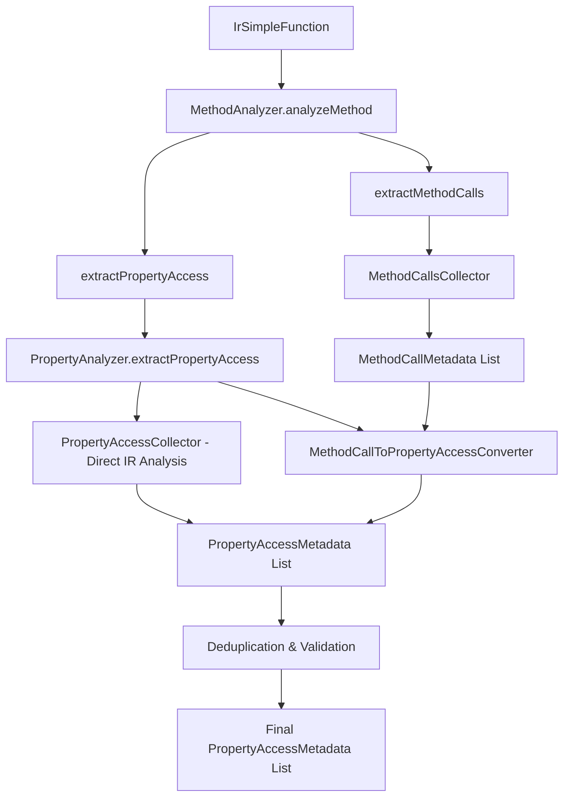

# Design Document

## Overview

This design addresses the critical issue in the Pragma DDD Analyzer where property access detection is incomplete. While method calls are correctly detected (e.g., `<set-status>`, `<get-status>`), the `propertyAccesses` array in analysis results remains empty. The root cause is that the current implementation has a disconnect between method call detection and property access metadata generation.

The solution involves enhancing the existing `PropertyAnalyzer` and `MethodAnalyzer` components to properly convert detected method calls into `PropertyAccessMetadata` objects and improve direct property access detection through IR analysis.

## Architecture

### Current Architecture Issues

1. **Method Call Detection Works**: The `MethodCallsCollector` correctly identifies Kotlin property setter/getter calls like `<set-status>` and `<get-status>`
2. **Property Access Conversion Fails**: The logic to convert these method calls into `PropertyAccessMetadata` objects is incomplete or not executing properly
3. **Direct IR Analysis Incomplete**: The `PropertyAccessCollector` in `PropertyAnalyzer` doesn't fully capture all property access patterns

### Enhanced Architecture



## Components and Interfaces

### Enhanced PropertyAnalyzer Interface

```kotlin
interface PropertyAnalyzer {
    fun extractPropertyAccess(irFunction: IrSimpleFunction): List<PropertyAccessMetadata>
    fun detectDirectFieldAccess(irFunction: IrSimpleFunction): List<PropertyAccessMetadata>
    fun detectGetterSetterCalls(irFunction: IrSimpleFunction): List<PropertyAccessMetadata>
    fun detectMethodChainPropertyAccess(irFunction: IrSimpleFunction): List<PropertyAccessMetadata>
    
    // New methods for enhanced detection
    fun convertMethodCallsToPropertyAccess(methodCalls: List<MethodCallMetadata>): List<PropertyAccessMetadata>
    fun detectComparisonPropertyAccess(irFunction: IrSimpleFunction): List<PropertyAccessMetadata>
    fun detectAssignmentPropertyAccess(irFunction: IrSimpleFunction): List<PropertyAccessMetadata>
}
```

### New MethodCallToPropertyAccessConverter

```kotlin
class MethodCallToPropertyAccessConverter {
    fun convertMethodCallsToPropertyAccess(methodCalls: List<MethodCallMetadata>): List<PropertyAccessMetadata>
    fun extractPropertyNameFromKotlinSetter(methodName: String): String?
    fun extractPropertyNameFromKotlinGetter(methodName: String): String?
    fun extractPropertyNameFromJavaStyleGetter(methodName: String): String?
    fun extractPropertyNameFromJavaStyleSetter(methodName: String): String?
}
```

### Enhanced PropertyAccessCollector

```kotlin
private class EnhancedPropertyAccessCollector : IrElementVisitorVoid {
    val propertyAccesses = mutableListOf<PropertyAccessMetadata>()
    
    // Existing methods enhanced
    override fun visitGetField(expression: IrGetField)
    override fun visitSetField(expression: IrSetField)
    override fun visitCall(expression: IrCall)
    
    // New methods for comprehensive detection
    override fun visitWhen(expression: IrWhen)  // For conditional property access
    override fun visitStringConcatenation(expression: IrStringConcatenation)  // For string interpolation
    override fun visitGetValue(expression: IrGetValue)  // Enhanced for property backing fields
    override fun visitSetValue(expression: IrSetValue)  // Enhanced for property assignments
}
```

## Data Models

### PropertyAccessMetadata (Existing - No Changes Needed)

```kotlin
data class PropertyAccessMetadata(
    val propertyName: String,
    val accessType: PropertyAccessType,  // GET or SET
    val ownerClass: String?
)

enum class PropertyAccessType {
    GET,  // Property read operation
    SET   // Property write operation
}
```

### PropertyAccessContext (New Internal Model)

```kotlin
internal data class PropertyAccessContext(
    val methodName: String,
    val className: String,
    val irFunction: IrSimpleFunction,
    val detectedAccesses: MutableList<PropertyAccessMetadata> = mutableListOf()
)
```

## Error Handling

### Error Categories

1. **IR Analysis Errors**: When IR traversal fails due to malformed or unsupported IR structures
2. **Property Name Extraction Errors**: When method names don't follow expected patterns
3. **Class Resolution Errors**: When owner class cannot be determined
4. **Deduplication Errors**: When identical property accesses cannot be properly merged

### Error Handling Strategy

```kotlin
class PropertyAccessErrorHandler(private val errorReporter: ErrorReporter) {
    fun handleIrAnalysisError(methodName: String, className: String, error: Exception): List<PropertyAccessMetadata>
    fun handlePropertyNameExtractionError(methodCall: MethodCallMetadata, error: Exception): PropertyAccessMetadata?
    fun handleClassResolutionError(propertyName: String, error: Exception): PropertyAccessMetadata
    fun logWarningAndContinue(message: String, context: PropertyAccessContext)
}
```

## Testing Strategy

### Unit Tests

1. **PropertyAnalyzer Tests**
   - Test direct field access detection (`IrGetField`, `IrSetField`)
   - Test method call to property access conversion
   - Test complex property access scenarios (conditionals, method chains)
   - Test error handling and edge cases

2. **MethodCallToPropertyAccessConverter Tests**
   - Test Kotlin setter pattern conversion (`<set-propertyName>` → SET access)
   - Test Kotlin getter pattern conversion (`<get-propertyName>` → GET access)
   - Test Java-style getter/setter conversion
   - Test invalid method name handling

3. **Integration Tests**
   - Test end-to-end property access detection in real Kotlin classes
   - Test property access detection in the Order class example
   - Test deduplication of identical property accesses
   - Test property access detection across different method types

### Test Cases for Order Class

```kotlin
// Test case: confirm() method should detect:
// - status property GET access (for comparison)
// - items property GET access (for isEmpty check)  
// - status property SET access (for assignment)

fun confirm() {
    if (status == OrderStatus.PENDING && items.isNotEmpty()) {  // GET: status, items
        status = OrderStatus.CONFIRMED  // SET: status
    }
}

// Expected PropertyAccessMetadata:
// 1. PropertyAccessMetadata("status", GET, "com.example.demo.domain.Order")
// 2. PropertyAccessMetadata("items", GET, "com.example.demo.domain.Order")  
// 3. PropertyAccessMetadata("status", SET, "com.example.demo.domain.Order")
```

## Implementation Plan

### Phase 1: Fix Method Call to Property Access Conversion

1. **Enhance MethodAnalyzer.analyzeMethod()**
   - Fix the logic that converts method calls to property accesses
   - Ensure the conversion happens and results are properly added to the final list

2. **Create MethodCallToPropertyAccessConverter**
   - Implement robust pattern matching for Kotlin and Java-style property access
   - Handle edge cases and invalid method names gracefully

### Phase 2: Enhance Direct IR Property Access Detection

1. **Improve PropertyAccessCollector**
   - Enhance `visitCall()` to better detect property access through method calls
   - Improve `visitGetValue()` and `visitSetValue()` for direct property access
   - Add support for conditional property access and complex expressions

2. **Add New IR Visitors**
   - Implement `visitWhen()` for conditional property access
   - Implement enhanced comparison and assignment detection

### Phase 3: Integration and Testing

1. **Integration Testing**
   - Test with the existing Order class and other domain classes
   - Verify that all property accesses are correctly detected and recorded

2. **Performance Optimization**
   - Optimize deduplication logic
   - Ensure minimal performance impact on compilation

### Phase 4: Documentation and Validation

1. **Update Documentation**
   - Document the enhanced property access detection capabilities
   - Provide examples of supported property access patterns

2. **Validation**
   - Validate against the requirements defined in the requirements document
   - Ensure backward compatibility with existing analysis results

## Key Design Decisions

### 1. Preserve Existing API

The existing `PropertyAnalyzer` interface and `PropertyAccessMetadata` model will be preserved to maintain backward compatibility. Enhancements will be additive rather than breaking changes.

### 2. Two-Phase Detection Strategy

The design uses a two-phase approach:
1. **Direct IR Analysis**: Detect property access through IR traversal
2. **Method Call Conversion**: Convert detected method calls to property access metadata

This ensures comprehensive coverage while maintaining clear separation of concerns.

### 3. Robust Error Handling

The design prioritizes robustness over perfection. If property access detection fails for a specific method, the analysis continues for other methods rather than failing entirely.

### 4. Deduplication Strategy

Property accesses are deduplicated based on the combination of `propertyName`, `accessType`, and `ownerClass`. This prevents duplicate entries while preserving meaningful distinctions.

### 5. Logging and Debugging

Enhanced logging will be added to help diagnose property access detection issues during development and debugging, using the existing error reporting infrastructure.