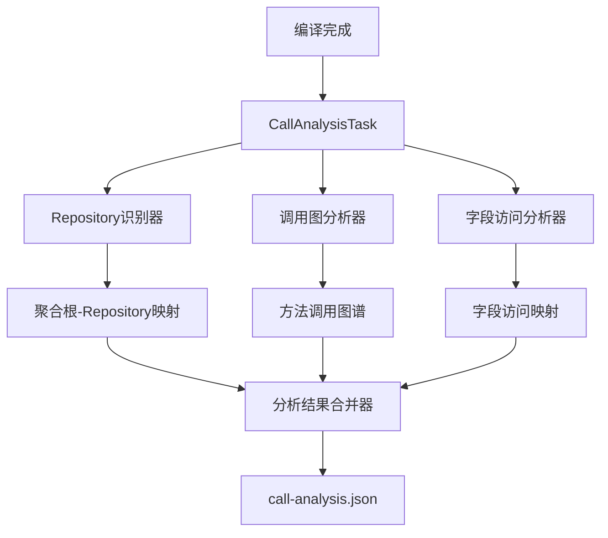

# 编译期静态分析系统设计

## 概述

本系统旨在构建一个通用的编译期静态分析工具，用于替代当前复杂的运行时堆栈跟踪分析机制。通过编译期字节码分析，准确识别Repository方法调用链并分析聚合根属性访问模式，从而为DDD应用提供优化的数据库查询策略。

## 技术架构

### 核心组件



### 分析流程

1. **Repository识别阶段**
   - 扫描编译输出目录
   - 识别@AggregateRoot注解的类
   - 匹配对应的Repository接口
   - 建立聚合根-Repository映射关系

2. **调用关系分析阶段**
   - 扫描所有业务类的字节码
   - 识别Repository方法调用点
   - 构建完整的方法调用图谱
   - 排除框架代理类和系统类

3. **字段访问分析阶段**
   - 基于domain-analyzer.json结果
   - 递归分析聚合根方法的字段访问
   - 处理嵌套对象和关联关系
   - 汇总所需的属性集合

## 核心算法设计

### Repository识别算法

```kotlin
class RepositoryIdentifier {
    fun identifyRepositories(aggregateRoots: Set<String>): Map<String, String> {
        val mappings = mutableMapOf<String, String>()
        
        for (aggregateRoot in aggregateRoots) {
            // 优先级1: DomainRepository<T>泛型接口
            val genericRepo = findGenericRepository(aggregateRoot)
            if (genericRepo != null) {
                mappings[aggregateRoot] = genericRepo
                continue
            }
            
            // 优先级2: @DomainRepository注解
            val annotatedRepo = findAnnotatedRepository(aggregateRoot)  
            if (annotatedRepo != null) {
                mappings[aggregateRoot] = annotatedRepo
                continue
            }
            
            // 优先级3: 命名约定
            val conventionRepo = findByNamingConvention(aggregateRoot)
            if (conventionRepo != null) {
                mappings[aggregateRoot] = conventionRepo
            }
        }
        
        return mappings
    }
}
```

### 调用图构建算法

```kotlin  
class CallGraphBuilder {
    fun buildCallGraph(classFiles: List<File>): CallGraph {
        val graph = CallGraph()
        
        for (classFile in classFiles) {
            if (isBusinessClass(classFile)) {
                val visitor = CallAnalysisVisitor(graph)
                ClassReader(classFile.inputStream()).accept(visitor, 0)
            }
        }
        
        return graph
    }
    
    private fun isBusinessClass(classFile: File): Boolean {
        val className = extractClassName(classFile)
        return !className.contains("$$") && // 排除CGLIB代理
               !className.startsWith("java.") && // 排除JDK类
               !className.startsWith("org.springframework.") // 排除Spring框架类
    }
}
```

### 字段访问递归分析

```kotlin
class FieldAccessAnalyzer {
    fun analyzeRequiredFields(
        repositoryMethod: MethodInfo,
        domainAnalysisResult: Map<String, DetailedClassInfo>
    ): Set<String> {
        val visited = mutableSetOf<MethodInfo>()
        val requiredFields = mutableSetOf<String>()
        
        analyzeMethodRecursively(repositoryMethod, domainAnalysisResult, visited, requiredFields)
        
        return requiredFields
    }
    
    private fun analyzeMethodRecursively(
        method: MethodInfo,
        analysisResult: Map<String, DetailedClassInfo>,
        visited: MutableSetOf<MethodInfo>,
        requiredFields: MutableSetOf<String>
    ) {
        if (method in visited) return // 循环依赖检测
        visited.add(method)
        
        val classInfo = analysisResult[method.className] ?: return
        val methodInfo = classInfo.methods.find { 
            it.methodName == method.methodName && it.methodDescriptor == method.descriptor 
        } ?: return
        
        // 收集直接字段访问
        methodInfo.propertyAccessAnalysis.forEach { access ->
            requiredFields.addAll(access.accessedProperties)
        }
        
        // 递归分析调用的方法
        methodInfo.propertyAccessAnalysis.forEach { access ->
            access.calledMethods.forEach { calledMethod ->
                if (isAggregateRootMethod(calledMethod)) {
                    val calledMethodInfo = MethodInfo(
                        calledMethod.className,
                        calledMethod.methodName, 
                        calledMethod.methodDescriptor
                    )
                    analyzeMethodRecursively(calledMethodInfo, analysisResult, visited, requiredFields)
                }
            }
        }
    }
}
```

## 数据模型设计

### 调用关系数据结构

```kotlin
data class CallAnalysisResult(
    val version: String = "1.0",
    val timestamp: String,
    val callGraph: Map<String, AggregateRootAnalysis>
)

data class AggregateRootAnalysis(
    val aggregateRootClass: String,
    val repositoryMethods: Map<String, RepositoryMethodAnalysis>
)

data class RepositoryMethodAnalysis(
    val methodDescriptor: String,
    val callers: Map<String, CallerMethodAnalysis>
)

data class CallerMethodAnalysis(
    val methodClass: String,
    val method: String,
    val methodDescriptor: String,
    val sourceLines: String, // "15-20"格式
    val repository: String,
    val repositoryMethod: String,
    val repositoryMethodDescriptor: String,
    val aggregateRoot: String,
    val calledAggregateRootMethods: List<CalledMethodInfo>,
    val requiredFields: Set<String>
)

data class CalledMethodInfo(
    val aggregateRootMethod: String,
    val aggregateRootMethodDescriptor: String,
    val requiredFields: Set<String>
)
```

### 输出JSON格式

```json
{
  "version": "1.0",
  "timestamp": "2024-01-01T00:00:00Z",
  "callGraph": {
    "com.example.domain.Goods": {
      "findByIdOrErr(J)Lcom/example/domain/Goods;": {
        "com.example.demo.service.changeAddressOrderCmdHandle.handle+15-20": {
          "methodClass": "com.example.demo.service.changeAddressOrderCmdHandle",
          "method": "handle",
          "methodDescriptor": "()V",
          "repository": "com.example.repository.GoodsRepository",
          "repositoryMethod": "findByIdOrErr",
          "repositoryMethodDescriptor": "(J)Lcom/example/domain/Goods;",
          "aggregateRoot": "com.example.domain.Goods",
          "calledAggregateRootMethod": [{
            "aggregateRootMethod": "changeAddress",
            "aggregateRootMethodDescriptor": "(J)",
            "requiredFields": ["id", "name"]
          }],
          "requiredFields": ["id", "name", "price", "category.name"]
        }
      }
    }
  }
}
```

## 插件集成设计

### Gradle任务扩展

```kotlin
@TaskAction
fun analyzeCallRelations() {
    val compilationOutput = project.layout.buildDirectory
        .dir("classes/kotlin/main").get().asFile
    
    val domainAnalysisFile = project.layout.buildDirectory
        .file("generated/pragma-ddd/domain-analyzer.json").get().asFile
    
    if (!domainAnalysisFile.exists()) {
        throw GradleException("domain-analyzer.json not found. Please run domain analysis first.")
    }
    
    val analyzer = CompileTimeCallAnalyzer(extension)
    val result = analyzer.analyze(compilationOutput, domainAnalysisFile)
    
    val outputFile = project.layout.buildDirectory
        .file("generated/pragma-ddd/call-analysis.json").get().asFile
        
    analyzer.writeResults(result, outputFile)
    
    logger.info("Call analysis completed. Results written to: ${outputFile.absolutePath}")
}
```

### 配置扩展

```kotlin
open class CompileTimeAnalysisExtension {
    var includePackages: List<String> = listOf("**")
    var excludePackages: List<String> = listOf("**.test.**", "**.tests.**")
    var repositoryNamingRules: List<String> = listOf(
        "{AggregateRoot}Repository",
        "I{AggregateRoot}Repository", 
        "{AggregateRoot}Repo"
    )
    var enableDebugMode: Boolean = false
    var cacheEnabled: Boolean = true
}
```

## 性能优化策略

### 增量分析机制

```kotlin
class IncrementalAnalyzer {
    fun shouldAnalyze(classFile: File, cacheDir: File): Boolean {
        val cacheFile = File(cacheDir, "${classFile.name}.cache")
        return !cacheFile.exists() || 
               classFile.lastModified() > cacheFile.lastModified()
    }
    
    fun getCachedResult(classFile: File, cacheDir: File): AnalysisResult? {
        val cacheFile = File(cacheDir, "${classFile.name}.cache")
        return if (cacheFile.exists()) {
            objectMapper.readValue(cacheFile, AnalysisResult::class.java)
        } else null
    }
}
```

### 缓存失效机制

- 基于文件修改时间戳检测变更
- 依赖关系变化时级联失效
- 配置变更时全量重新分析

## 运行时API设计

### 简化的调用接口

```kotlin
object CompileTimeAnalysisUtils {
    private val analysisResults: Map<String, CallAnalysisResult> by lazy {
        loadAnalysisResults()
    }
    
    fun getRequiredFields(aggregateRootClass: Class<*>): Set<String> {
        val stackTrace = Thread.currentThread().stackTrace
        val caller = identifyBusinessCaller(stackTrace)
        
        return analysisResults[aggregateRootClass.name]
            ?.repositoryMethods?.values
            ?.flatMap { it.callers.values }
            ?.find { matchesCaller(it, caller) }
            ?.requiredFields
            ?: emptySet()
    }
    
    private fun loadAnalysisResults(): Map<String, CallAnalysisResult> {
        val resourcePath = "/META-INF/pragma-ddd/call-analysis.json"
        val inputStream = javaClass.getResourceAsStream(resourcePath)
            ?: throw IllegalStateException("Analysis results not found: $resourcePath")
        
        return objectMapper.readValue(inputStream, 
            object : TypeReference<Map<String, CallAnalysisResult>>() {})
    }
}
```

## 测试验证策略

### 单元测试覆盖

```kotlin
class CallAnalysisTest {
    @Test
    fun `should identify all repository calls`() {
        val testClasses = loadTestClasses()
        val analyzer = CompileTimeCallAnalyzer(defaultConfig)
        val result = analyzer.analyze(testClasses)
        
        // 验证识别覆盖率
        assertThat(result.callGraph).hasSize(expectedRepositoryCallCount)
        assertThat(result.callGraph.keys).containsAll(expectedAggregateRoots)
    }
    
    @Test
    fun `should analyze field access accurately`() {
        val result = analyzeTestMethod("changeAddressOrderCmdHandle.handle")
        
        // 验证字段访问准确性  
        assertThat(result.requiredFields).contains("id", "name", "price")
        assertThat(result.requiredFields).doesNotContain("internalField")
    }
}
```

### 集成测试验证

- 基于demo模块和jimmer模块的test代码进行验证
- 测试各种Repository识别模式
- 验证复杂调用链的分析准确性
- 性能基准测试

## 部署和维护

### CI/CD集成

```kotlin
// build.gradle.kts
tasks.named("compileKotlin") {
    finalizedBy("analyzeCallRelations")
}

tasks.named("processResources") {
    dependsOn("analyzeCallRelations")
}
```

### 监控和调试

- 详细的分析日志输出
- 调试模式下的中间结果展示
- 性能指标收集和报告
- 错误诊断和恢复机制