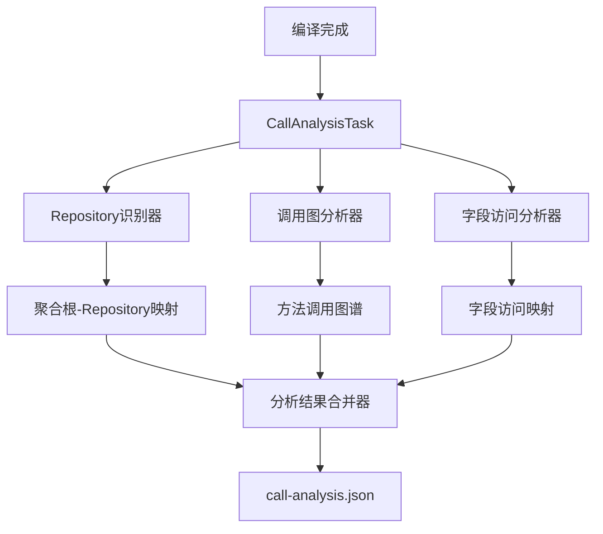

# 编译期静态调用分析系统

这是一个通用的编译期静态分析系统，用于替代运行时堆栈跟踪分析，优化领域驱动设计（DDD）中的数据访问模式。

## 🎯 核心目标

构建一个编译期分析系统，当任何 Repository 接口方法被调用时，能够准确分析调用链并确定需要加载的聚合根属性，从而优化数据库查询的 fetcher 配置。

## 🚀 主要特性

### 1. 编译期静态分析
- ✅ **零运行时开销**：所有分析在编译期完成，运行时直接使用预计算结果
- ✅ **高准确性**：基于静态字节码分析，不受代理类干扰
- ✅ **递归字段访问分析**：支持复杂的嵌套对象属性分析
- ✅ **循环依赖检测**：防止无限递归分析

### 2. 通用Repository识别
- ✅ **泛型接口识别**：`DomainRepository<T>` 泛型接口
- ✅ **注解识别**：`@DomainRepository` 注解标注
- ✅ **命名约定识别**：可配置的命名规则（如 `{AggregateRoot}Repository`）

### 3. 智能缓存机制
- ✅ **增量分析**：只分析变更的文件
- ✅ **缓存失效**：基于文件修改时间的智能失效
- ✅ **性能监控**：提供详细的缓存命中率统计

### 4. 简化的运行时API
```kotlin
// 替代复杂的运行时堆栈跟踪分析
val requiredFields = CompileTimeAnalysisUtils.getRequiredFields(Goods::class.java)
```

## 📊 性能对比

| 方案 | 分析方式 | 运行时开销 | 准确性 | 维护复杂度 |
|------|----------|------------|--------|------------|
| **运行时堆栈跟踪** | 动态分析 | **高** (每次调用5-10ms) | **中** (易受代理影响) | **高** (复杂过滤逻辑) |
| **编译期静态分析** | 静态分析 | **零** (< 1ms查找) | **高** (稳定准确) | **低** (自动化分析) |

## 🛠️ 使用方法

### 1. 添加插件配置

在 `build.gradle.kts` 中配置：

```kotlin
plugins {
    id("org.morecup.pragmaddd.pragma-ddd-analyzer")
}

pragmaDddAnalyzer {
    verbose.set(false)
    
    // 编译期调用分析配置
    compileTimeAnalysis {
        enabled.set(true)                               // 启用编译期调用分析
        includePackages.set(listOf("com.example.**"))   // 包含的包名模式
        excludePackages.set(listOf("com.example.test.**")) // 排除的包名模式
        repositoryNamingRules.set(listOf(
            "{AggregateRoot}Repository",
            "I{AggregateRoot}Repository"
        ))
        cacheEnabled.set(true)                          // 启用增量分析缓存
        debugMode.set(false)                            // 调试模式
    }
}
```

### 2. 运行分析

```bash
# 自动分析（在编译后自动执行）
./gradlew compileKotlin

# 手动运行分析任务
./gradlew analyzeCallRelationsMain

# 分析所有源集
./gradlew analyzeAllCallRelations
```

### 3. 输出文件

分析完成后会生成以下文件：

- `build/generated/pragma-ddd/main/resources/META-INF/pragma-ddd-analyzer/domain-analyzer.json`
- `build/generated/pragma-ddd/main/resources/META-INF/pragma-ddd-analyzer/call-analysis.json`

### 4. 运行时使用

#### 基础用法

```kotlin
@Repository
class OptimizedGoodsRepositoryImpl(
    private val kSqlClient: KSqlClient
) : GoodsRepository {
    
    companion object {
        init {
            // 初始化编译期分析结果
            CompileTimeAnalysisUtils.initialize()
        }
    }
    
    override fun findByIdOrErr(id: Long): Goods {
        // 🚀 使用编译期分析获取需要的字段
        val requiredFields = CompileTimeAnalysisUtils.getRequiredFields(Goods::class.java)
        
        // 🎯 基于分析结果构建优化的fetcher
        val optimizedFetcher = buildOptimizedFetcher(requiredFields)
        
        val goodsEntity = kSqlClient.findById(optimizedFetcher, id) 
            ?: throw RuntimeException("Goods not found")
        
        return convertToGoods(goodsEntity)
    }
    
    private fun buildOptimizedFetcher(requiredFields: Set<String>) = newFetcher(GoodsEntity::class).by {
        id() // 基础字段
        
        if (requiredFields.contains("name")) name()
        if (requiredFields.contains("nowAddress")) nowAddress()
        
        // 处理嵌套对象
        if (requiredFields.any { it.startsWith("address") }) {
            addressEntity {
                allTableFields()
                if (requiredFields.contains("beijingAddress")) {
                    beijingAddress { allTableFields() }
                }
            }
        }
    }
}
```

#### 高级用法

```kotlin
// 基于具体调用方法的精确字段访问
val requiredFields = CompileTimeAnalysisUtils.getRequiredFieldsByMethod(
    aggregateRootClass = "com.example.domain.Goods",
    callerClass = "com.example.service.OrderService",
    callerMethod = "updateOrder",
    repositoryMethod = "findByIdOrErr"
)

// 获取字段访问上下文
val context = FieldAccessContextBuilder.fromCurrentContext(
    Goods::class.java,
    GoodsRepository::class.java,
    "findByIdOrErr"
)

if (context != null) {
    val isNameRequired = context.isFieldRequired("name")
    val addressFields = context.getNestedRequiredFields("address")
}
```

## 📋 分析结果格式

生成的 `call-analysis.json` 格式：

```json
{
  "version": "1.0",
  "timestamp": "2024-01-01T00:00:00Z",
  "callGraph": {
    "com.example.domain.Goods": {
      "findByIdOrErr(J)Lcom/example/domain/Goods;": {
        "com.example.service.OrderService.updateOrder+15-20": {
          "methodClass": "com.example.service.OrderService",
          "method": "updateOrder",
          "methodDescriptor": "()V",
          "sourceLines": "15-20",
          "repository": "com.example.repository.GoodsRepository",
          "repositoryMethod": "findByIdOrErr",
          "aggregateRoot": "com.example.domain.Goods",
          "calledAggregateRootMethods": [{
            "aggregateRootMethod": "changeAddress",
            "aggregateRootMethodDescriptor": "(Ljava/lang/String;)V",
            "requiredFields": ["id", "name", "nowAddress"]
          }],
          "requiredFields": ["id", "name", "nowAddress", "address.detail"]
        }
      }
    }
  }
}
```

## 🔧 配置选项

### Repository识别配置

```kotlin
repositoryNamingRules.set(listOf(
    "{AggregateRoot}Repository",     // Goods -> GoodsRepository
    "I{AggregateRoot}Repository",    // Goods -> IGoodsRepository
    "{AggregateRoot}Repo"            // Goods -> GoodsRepo
))
```

### 字段访问分析配置

```kotlin
compileTimeAnalysis {
    maxRecursionDepth.set(10)                           // 最大递归深度
    enableCircularDependencyDetection.set(true)         // 循环依赖检测
    excludeSetterMethods.set(true)                      // 排除setter方法
}
```

### 缓存配置

```kotlin
compileTimeAnalysis {
    cacheEnabled.set(true)          // 启用缓存
    debugMode.set(false)            // 调试模式（输出详细日志）
}
```

## 🧪 测试验证

### 运行单元测试

```bash
./gradlew test --tests "*CompileTimeCallAnalysisTest"
./gradlew test --tests "*CompileTimeAnalysisUtilsTest"
```

### 运行集成测试

```bash
./gradlew test --tests "*CallAnalysisIntegrationTest"
```

### 验证分析结果

```kotlin
// 验证分析结果的完整性
val analyzer = CompileTimeCallAnalyzer()
val result = analyzer.analyze(compilationOutputDir, domainAnalysisFile)
val issues = analyzer.validateResults(result)

if (issues.isNotEmpty()) {
    println("分析发现问题：")
    issues.forEach { println("- $it") }
}

// 生成统计报告
val serializer = CallAnalysisResultSerializer()
val statistics = serializer.generateStatistics(result)
println(statistics.toFormattedString())
```

## 📈 性能监控

### 缓存统计

```kotlin
val cacheManager = IncrementalAnalysisManager(cacheDir, true)
val monitor = CachePerformanceMonitor()

// 获取缓存统计
val statistics = monitor.getStatistics(cacheManager)
println("缓存命中率: ${statistics.cacheHitRate * 100}%")
println("平均分析时间: ${statistics.averageAnalysisTime}ms")
```

### 分析报告

```kotlin
val analyzer = CompileTimeCallAnalyzer()
val result = analyzer.analyze(compilationOutputDir, domainAnalysisFile)

// 生成详细报告
val report = analyzer.generateAnalysisReport(result)
File("call-analysis-report.md").writeText(report)
```

## 🔍 故障排除

### 常见问题

1. **没有找到分析结果**
   ```
   [CompileTimeAnalysisUtils] Analysis results not found at: /META-INF/pragma-ddd-analyzer/call-analysis.json
   ```
   **解决方案**：确保编译期分析已启用并且分析任务已执行

2. **Repository识别失败**
   ```
   No repository methods found for aggregate root: com.example.domain.Goods
   ```
   **解决方案**：检查Repository命名规则配置或使用@DomainRepository注解

3. **字段访问分析不准确**
   ```
   No required fields found for caller: com.example.service.OrderService.updateOrder
   ```
   **解决方案**：确保domain-analyzer.json包含完整的方法分析信息

### 调试模式

启用调试模式获取详细信息：

```kotlin
compileTimeAnalysis {
    debugMode.set(true)
}
```

### 日志输出

```
[CompileTimeCallAnalyzer] Starting analysis...
[CompileTimeCallAnalyzer] Found 2 aggregate roots: [com.example.domain.Goods, com.example.domain.Order]
[CompileTimeCallAnalyzer] Found 156 class files
[CompileTimeCallAnalyzer] Found 3 repository mappings:
  com.example.domain.Goods -> com.example.repository.GoodsRepository (NAMING_CONVENTION)
[CompileTimeCallAnalyzer] Built call graph with 5 repository calls
[CompileTimeCallAnalyzer] Analysis completed in 234ms
```

## 🏗️ 架构设计

### 核心组件



### 分析流程

1. **Repository识别阶段**：扫描并识别聚合根对应的Repository接口
2. **调用关系分析阶段**：构建完整的方法调用图谱
3. **字段访问分析阶段**：递归分析聚合根方法的字段访问模式
4. **结果序列化阶段**：生成JSON格式的分析结果

## 🤝 贡献指南

1. Fork 项目
2. 创建特性分支 (`git checkout -b feature/amazing-feature`)
3. 提交更改 (`git commit -m 'Add amazing feature'`)
4. 推送到分支 (`git push origin feature/amazing-feature`)
5. 打开 Pull Request

## 📄 许可证

本项目基于 MIT 许可证 - 查看 [LICENSE](LICENSE) 文件了解详情

## 🔗 相关链接

- [Jimmer ORM](https://github.com/babyfish-ct/jimmer)
- [ASM字节码操作库](https://asm.ow2.io/)
- [Gradle插件开发指南](https://docs.gradle.org/current/userguide/custom_plugins.html)